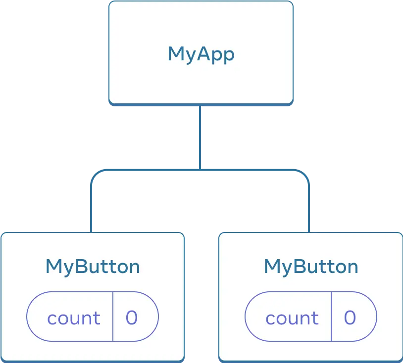
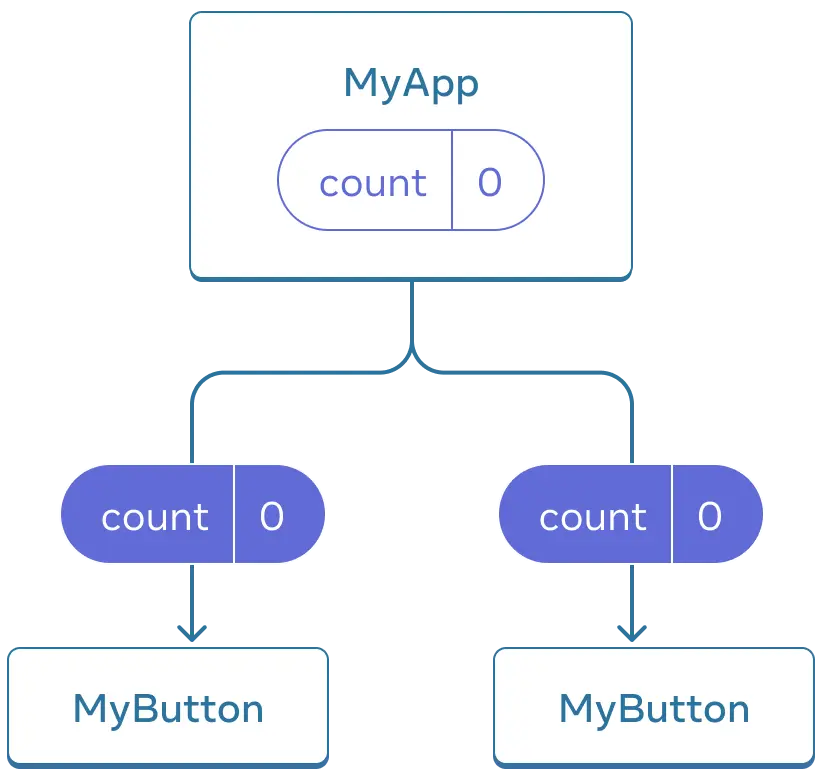

React apps are made out of components. A component is a piece of the UI (user interface) that has its own logic and appearance. A component can be as small as a button, or as large as an entire page.React components are JavaScript functions that return markup:
```react
function MyButton() {
  return (
    <button>I'm a button</button>
  );
}
```
Now that you’ve declared MyButton, you can nest it into another component:
```react
export default function MyApp() {
  return (
    <div>
      <h1>Welcome to my app</h1>
      <MyButton />
    </div>
  );
}
```
Notice that <MyButton /> starts with a capital letter. That’s how you know it’s a React component. React component names must always start with a capital letter, while HTML tags must be lowercase. Have a look at the result:
```react
function MyButton() {
  return (
    <button>
      I'm a button
    </button>
  );
}

export default function MyApp() {
  return (
    <div>
      <h1>Welcome to my app</h1>
      <MyButton />
    </div>
  );
}
```
The export default keywords specify the main component in the file. If you’re not familiar with some piece of JavaScript syntax, MDN and javascript.info have great references.
## Writing markup with JSX
In React, **JSX** stands for **JavaScript XML**.

It's a syntax extension for JavaScript that allows you to write HTML-like code directly within your JavaScript files. Instead of separating your markup and your logic into different files (like an HTML file and a JavaScript file), JSX brings them together.

#### Here's what that means and why it's used:

* **HTML-like Syntax in JavaScript:** JSX looks very similar to HTML. You use familiar tags like `<div>`, `<span>`, `<p>`, `<h1>`, etc., but you write them inside your JavaScript code.

    ```jsx
    const element = <h1>Hello, React!</h1>;
    ```

* **Syntactic Sugar for `React.createElement()`:** Under the hood, JSX is not actually HTML that gets rendered directly by the browser. Instead, it's "syntactic sugar" for `React.createElement()` calls. When your JSX code is compiled (usually by Babel), it gets transformed into JavaScript function calls that create React elements.

    The JSX:
    ```jsx
    const element = <h1>Hello, React!</h1>;
    ```
    Gets compiled into something like:
    ```javascript
    const element = React.createElement("h1", null, "Hello, React!");
    ```

* **Declarative UI:** JSX makes it much easier and more intuitive to describe what your UI should look like. You declare the structure and content of your components directly in your code, which aligns well with React's declarative approach to building user interfaces.

* **Component-Based Architecture:** JSX is fundamental to React's component-based architecture. You define reusable UI components using JSX, making it simple to compose complex UIs from smaller, independent pieces.

it is said that JSX is stricter than html yes it is absolutely right! JSX is indeed stricter than HTML, and this strictness comes from its nature as a syntax extension for **JavaScript**, rather than a standalone markup language. 
#### Here's a breakdown of why it's stricter:

1.  **All Tags Must Be Closed:**
    * **HTML:** HTML is quite forgiving. You can often omit closing tags for certain elements like `<p>`, `<li>`, `<br>`, ``, etc., and the browser will try to infer what you meant.
    * **JSX:** Every tag in JSX *must* be explicitly closed. This applies to both opening/closing pairs (e.g., `<div></div>`) and self-closing tags (e.g., ``, `<br />`). This is because JSX is processed by a compiler (like Babel) into JavaScript function calls, and these calls require a clear beginning and end for each element.
        ```jsx
        // Valid JSX
        <br />
        
        <p>This is a paragraph.</p>

        // Invalid JSX (would throw an error)
        <br>
        
        <p>This is a paragraph.
        ```

2.  **Single Root Element (or Fragment):**
    * **HTML:** You can write multiple top-level HTML elements directly in a file without a single encompassing parent.
    * **JSX:** A JSX expression must return a single root element. If you want to return multiple elements, they must be wrapped within a single parent tag. This can be a standard HTML element (`<div>`, `<section>`), or a special React `Fragment` (`<>...</>`) which doesn't add an extra node to the DOM. This requirement stems from JSX compiling into a single JavaScript function call that returns a single object (the React element).
        ```jsx
        // Valid JSX (single root element)
        <div>
          <h1>Hello</h1>
          <p>World</p>
        </div>

        // Valid JSX (using a Fragment)
        <>
          <h1>Hello</h1>
          <p>World</p>
        </>

        // Invalid JSX (would throw an error - multiple top-level elements)
        <h1>Hello</h1>
        <p>World</p>
        ```

3.  **`camelCase` for Attributes (Props):**
    * **HTML:** HTML attributes are typically written in `kebab-case` (e.g., `class`, `tabindex`, `onclick`).
    * **JSX:** Since JSX is JavaScript, attribute names (which become "props" in React) follow JavaScript's `camelCase` convention. This is because these attributes are essentially properties on JavaScript objects that React creates.
        * `class` becomes `className` (because `class` is a reserved keyword in JavaScript).
        * `tabindex` becomes `tabIndex`.
        * `onclick` becomes `onClick`.
        ```jsx
        // Valid JSX
        <div className="my-class" tabIndex={0} onClick={handleClick}>
          Click me
        </div>

        // Invalid JSX (would throw an error)
        <div class="my-class" tabindex="0" onclick="handleClick()">
          Click me
        </div>
        ```

4.  **No `false` or `null` attributes (with a few exceptions):**
    * **HTML:** You can sometimes omit an attribute or set it to an empty string, and it might behave as a boolean `true` (e.g., `<input disabled>`).
    * **JSX:** While you can pass `true` or `false` for boolean attributes, if you pass `null` or `undefined` as a prop value, React will typically ignore it.

    Sure! Let's expand on the concept of handling boolean attributes in **HTML**, **JSX**, and how special values like `false`, `null`, and `undefined` are treated in each context.

---

###### 🔷 Boolean Attributes in HTML

In **HTML**, boolean attributes are attributes that can be either present (true) or absent (false). Their mere **presence** means "true", and **absence** means "false".

### ✅ Examples of boolean attributes in HTML:

* `disabled`
* `checked`
* `readonly`
* `required`
* `autofocus`
* `selected`
* `multiple`

### ✅ HTML Behavior:

```html
<!-- TRUE: Disabled input -->
<input type="text" disabled>

<!-- FALSE: Enabled input (disabled is absent) -->
<input type="text">
```

> 💡 In HTML, writing `disabled="false"` **still disables the input**, because the browser only cares that the attribute is **present**, regardless of its value.

So in pure HTML:

* ✅ `<input disabled>` → interpreted as true
* ✅ `<input disabled="true">` → interpreted as true
* ✅ `<input disabled="false">` → still interpreted as true
* ❌ To make it false, you must **remove the attribute entirely**: `<input>`

---

## 🔷 Boolean Attributes in JSX (used in React)

In **JSX** (JavaScript XML), which is used in React, attributes (props) are treated more like JavaScript properties than raw HTML strings. JSX lets you express boolean logic more explicitly.

### ✅ JSX Behavior:

```jsx
<input disabled={true} />     // disabled
<input disabled={false} />    // not disabled
<input disabled={null} />     // not disabled (null is ignored)
<input disabled={undefined} />// not disabled (undefined is ignored)
```

### ✅ React JSX Special Cases:

* If a prop is set to `false`, `null`, or `undefined`, React **omits** that attribute from the rendered HTML entirely.
* If a boolean prop is `true`, React includes the attribute **without a value** (just like HTML).

> 💡 For example, `<input disabled={true} />` becomes `<input disabled>` in the rendered HTML, which is correct and expected.

---

### 🔍 Summary: Comparison Table

| Attribute Value        | HTML Behavior  | JSX Behavior (React)                        |
| ---------------------- | -------------- | ------------------------------------------- |
| `disabled`             | true           | true                                        |
| `disabled="true"`      | true           | true (if passed as boolean)                 |
| `disabled="false"`     | **still true** | (only if passed as string, not recommended) |
| `disabled={true}`      | —              | true                                        |
| `disabled={false}`     | —              | **attribute not rendered**                  |
| `disabled={null}`      | —              | **attribute not rendered**                  |
| `disabled={undefined}` | —              | **attribute not rendered**                  |

---

## ✅ Best Practices

* In HTML: Don’t try to "disable" an attribute by setting it to `"false"`—just remove it.
* In JSX:

  * Use `true`/`false` explicitly as booleans: `<input disabled={isDisabled} />`
  * Let `null` or `undefined` act as “not present” if the condition is optional.
  * Don’t pass strings like `"true"` or `"false"` unless absolutely necessary (React treats them as strings, not booleans).


5.  **Embedding JavaScript Expressions with `{}`:**
    * **HTML:** To embed dynamic content or logic, you'd typically use server-side templating languages or separate JavaScript code to manipulate the DOM.
    * **JSX:** You use curly braces `{}` to "escape" back into JavaScript and embed any valid JavaScript expression (variables, function calls, arithmetic, etc.) directly within your markup. This is a powerful feature but also enforces valid JavaScript syntax within those braces.
        ```jsx
        const name = "React";
        const element = <h1>Hello, {name.toUpperCase()}!</h1>;
        ```

6.  **Case Sensitivity:**
    * **HTML:** HTML tag names are case-insensitive (e.g., `<div>` is the same as `<DIV>`).
    * **JSX:** JSX tags are case-sensitive. By convention, built-in HTML elements are lowercase (e.g., `div`, `span`), while React components you define start with an uppercase letter (e.g., `<MyComponent />`). This allows React to differentiate between native DOM elements and your custom components.
        ```jsx
        // Valid JSX (built-in HTML element)
        <div></div>

        // Valid JSX (custom React component)
        <MyComponent />

        // Invalid JSX (would be treated as a custom component, not HTML div)
        <Div></Div>
        ```

Essentially, JSX is designed to be a bridge between HTML's declarative nature for UI and JavaScript's programmatic power. Because it needs to be reliably transformed into executable JavaScript code, it requires a more consistent and stricter syntax than the often-lenient HTML specification. This strictness helps in catching errors earlier in the development process and leads to more predictable and robust code.

### Displaying data 
JSX lets you put markup into JavaScript. Curly braces let you “escape back” into JavaScript so that you can embed some variable from your code and display it to the user. For example, this will display user.name:
```react
return (
  <h1>
    {user.name}
  </h1>
);
```
You can also “escape into JavaScript” from JSX attributes, but you have to use curly braces instead of quotes. For example, className="avatar" passes the "avatar" string as the CSS class, but src={user.imageUrl} reads the JavaScript user.imageUrl variable value, and then passes that value as the src attribute:
```react
return (
  
);
```
You can put more complex expressions inside the JSX curly braces too, for example, string concatenation:
```react
const user = {
  name: 'Hedy Lamarr',
  imageUrl: 'https://i.imgur.com/yXOvdOSs.jpg',
  imageSize: 90,
};

export default function Profile() {
  return (
    <>
      <h1>{user.name}</h1>
      
    </>
  );
}
```
In the above example, style={{}} is not a special syntax, but a regular {} object inside the style={ } JSX curly braces. You can use the style attribute when your styles depend on JavaScript variables.
### Conditional rendering 
In React, there is no special syntax for writing conditions. Instead, you’ll use the same techniques as you use when writing regular JavaScript code. For example, you can use an if statement to conditionally include JSX:

```react
let content;
if (isLoggedIn) {
  content = <AdminPanel />;
} else {
  content = <LoginForm />;
}
return (
  <div>
    {content}
  </div>
);
```
If you prefer more compact code, you can use the conditional ? operator. Unlike if, it works inside JSX:

```react
<div>
  {isLoggedIn ? (
    <AdminPanel />
  ) : (
    <LoginForm />
  )}
</div>
```
When you don’t need the else branch, you can also use a shorter logical && syntax:
```react
<div>
  {isLoggedIn && <AdminPanel />}
</div>
```
All of these approaches also work for conditionally specifying attributes. If you’re unfamiliar with some of this JavaScript syntax, you can start by always using if...else.

### Rendering lists 
You will rely on JavaScript features like for loop and the array map() function to render lists of components.

For example, let’s say you have an array of products:
```react
const products = [
  { title: 'Cabbage', id: 1 },
  { title: 'Garlic', id: 2 },
  { title: 'Apple', id: 3 },
];
```
Inside your component, use the map() function to transform an array of products into an array of <li> items:
```react
const listItems = products.map(product =>
  <li key={product.id}>
    {product.title}
  </li>
);

return (
  <ul>{listItems}</ul>
);
```
Notice how <li> has a key attribute. For each item in a list, you should pass a string or a number that uniquely identifies that item among its siblings. Usually, a key should be coming from your data, such as a database ID. React uses your keys to know what happened if you later insert, delete, or reorder the items.

```react
const products = [
  { title: 'Cabbage', isFruit: false, id: 1 },
  { title: 'Garlic', isFruit: false, id: 2 },
  { title: 'Apple', isFruit: true, id: 3 },
];

export default function ShoppingList() {
  const listItems = products.map(product =>
    <li
      key={product.id}
      style={{
        color: product.isFruit ? 'magenta' : 'darkgreen'
      }}
    >
      {product.title}
    </li>
  );

  return (
    <ul>{listItems}</ul>
  );
}
```
### Responding to events 
You can respond to events by declaring event handler functions inside your components:
```react
function MyButton() {
  function handleClick() {
    alert('You clicked me!');
  }

  return (
    <button onClick={handleClick}>
      Click me
    </button>
  );
}
```
Notice how onClick={handleClick} has no parentheses at the end! Do not call the event handler function: you only need to pass it down. React will call your event handler when the user clicks the button.

### Updating the screen 
Often, you’ll want your component to “remember” some information and display it. For example, maybe you want to count the number of times a button is clicked. To do this, add state to your component.

First, import useState from React:

```react
import { useState } from 'react';
```
Now you can declare a state variable inside your component:
```react
function MyButton() {
  const [count, setCount] = useState(0);
  // ...
```

You’ll get two things from useState: the current state (count), and the function that lets you update it (setCount). You can give them any names, but the convention is to write [something, setSomething].

The first time the button is displayed, count will be 0 because you passed 0 to useState(). When you want to change state, call setCount() and pass the new value to it. Clicking this button will increment the counter:

```react
function MyButton() {
  const [count, setCount] = useState(0);

  function handleClick() {
    setCount(count + 1);
  }

  return (
    <button onClick={handleClick}>
      Clicked {count} times
    </button>
  );
}
```
React will call your component function again. This time, count will be 1. Then it will be 2. And so on.

If you render the same component multiple times, each will get its own state. Click each button separately:
```react
import { useState } from 'react';

export default function MyApp() {
  return (
    <div>
      <h1>Counters that update separately</h1>
      <MyButton />
      <MyButton />
    </div>
  );
}

function MyButton() {
  const [count, setCount] = useState(0);

  function handleClick() {
    setCount(count + 1);
  }

  return (
    <button onClick={handleClick}>
      Clicked {count} times
    </button>
  );
}
```
Notice how each button “remembers” its own count state and doesn’t affect other buttons.

### Using Hooks 

Functions starting with use are called Hooks. useState is a built-in Hook provided by React. You can find other built-in Hooks in the API reference. You can also write your own Hooks by combining the existing ones.

Hooks are more restrictive than other functions. You can only call Hooks at the top of your components (or other Hooks). If you want to use useState in a condition or a loop, extract a new component and put it there.

### Sharing data between components 
In the previous example, each MyButton had its own independent count, and when each button was clicked, only the count for the button clicked changed:


However, often you’ll need components to share data and always update together.

To make both MyButton components display the same count and update together, you need to move the state from the individual buttons “upwards” to the closest component containing all of them.

In this example, it is MyApp:
